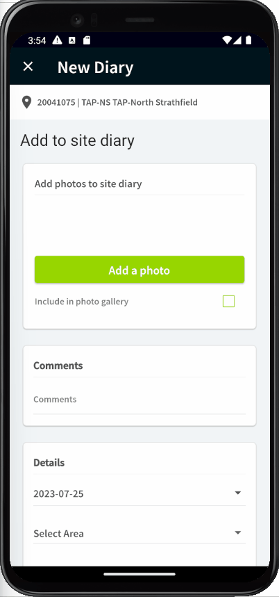

# Martin Pulgar Construction App


<br /><br />
Martin Pulgar Construction is a fictitious construction company. They have approached their IT department <br />to create a new mobile app for their ground staff to upload photos.
<br /><br />




### Installing

Install dependencies

```
flutter pub get
```

### Run the app

```
flutter run -v -d emulator-5554 (your device)
```

## Running the tests

```
flutter test
```

## Building scripts for [Mobx](https://pub.dev/packages/mobx) and [Mockito](https://pub.dev/packages/mockito):

```
dart run build_runner watch --delete-conflicting-outputs
```

## Built With

* [Flutter](https://flutter.dev) - Build apps for any screen
* [Dart](https://dart.dev) - Dart is a client-optimized language for fast apps on any platform
* [Mobx](https://pub.dev/packages/mobx) - MobX is a state-management library that makes it simple to connect the reactive data of your application with the UI
* [Mockito](https://pub.dev/packages/mockito) - Let's create mocks!

## Authors

* **Dry F.** - *Initial work* - [Linkedin](https://www.linkedin.com/in/dreyfiferreira) - [Website](https://dreyfi.com)

## Thanks

* All coffee makers in Australia
* My two dogs Nina and Dinger
* GTA V Online
